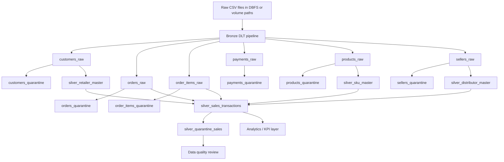

# FMCG_PROJECT

## FMCG data pipeline for Databricks DLT

This repository contains a bronze-to-silver data pipeline for FMCG-style sales data using Databricks Delta Live Tables and PySpark. The code is centered on a raw ingestion layer, cleaning utilities, curated master tables, transaction shaping, and quarantine tables for records that fail validation.

## What this repository actually contains

- `FMCG-Pipeline/transformations/bronze/bronze_dlt.py`: bronze ingestion tables, schemas, and quarantine logic for customers, orders, order items, payments, products, and sellers.
- `FMCG-Pipeline/transformations/bronze/common_utils.py`: shared column-cleaning and metadata helpers.
- `FMCG-Pipeline/transformations/silver/silver_dlt.py`: silver tables for retailer, distributor, and SKU masters, plus enriched sales transactions and quarantined sales.

## Architecture

### Pipeline layers

- Bronze: schema-aware ingestion from raw CSV inputs with metadata stamping and quarantine handling.
- Silver: standardization, master-data shaping, and transaction enrichment.
- Quality control: invalid records are isolated into quarantine tables with failure reasons.
- Analytics: the silver transaction layer becomes the foundation for KPI outputs or BI models.

## Badges that fit the project

- Python 3.10+ for the PySpark codebase.
- Databricks DLT because the pipeline is built around Delta Live Tables.
- Apache Spark because the transformations are implemented with `pyspark`.
- Bronze | Silver | Gold architecture because that is the actual structure of the data flow.

## File map

- `FMCG-Pipeline/transformations/bronze/bronze_dlt.py` defines schemas for customers, orders, order items, payments, products, and sellers, then writes clean and quarantine bronze tables.
- `FMCG-Pipeline/transformations/bronze/common_utils.py` normalizes column names and adds metadata.
- `FMCG-Pipeline/transformations/silver/silver_dlt.py` creates master tables for retailers, distributors, and SKUs, then joins orders and items into a curated sales fact.
- `outputs/` currently contains placeholder CSV files in this workspace snapshot, so the README does not claim real KPI numbers.

## How the pipeline works

1. `bronze_dlt.py` reads raw CSV files from volume paths such as `/Volumes/fmcg/bronze/...`.
2. Each source is cleaned with `clean_columns`, schema-validated, and stamped with ingest metadata.
3. Valid rows land in curated bronze tables and invalid rows are isolated into quarantine tables.
4. `silver_dlt.py` builds master entities for retailers, distributors, and SKUs, then enriches sales transactions by joining those masters.
5. The result is a structured transaction layer that can feed KPI jobs, BI dashboards, or downstream analytics.

## Repository status

- The current workspace snapshot shows the transformation logic concentrated in the `FMCG-Pipeline/transformations/` tree.
- The docs under `docs/` are empty right now, so this README is the best source of truth in the repo at the moment.
- The `outputs/` CSVs are empty in this snapshot, which is why the README stays honest and avoids fabricated metric examples.

## Next steps if you want to extend this

- Add a `requirements.txt` with pinned `dlt`, `pyspark`, and testing dependencies.
- Add generated KPI notebooks or scripts for sales, SKU, distributor, and stock aging metrics.
- Add a deployment section for Databricks setup, volumes, and pipeline execution.
- Add sample raw CSVs so the pipeline can be run end to end in a fresh workspace.

## Contributing

If you want, I can now do one of these next:

1. Convert this into a more polished Databricks-style README with setup instructions and execution steps.
2. Add a dedicated architecture markdown file under `diagrams/` and reference it from the README.
3. Generate a pinned `requirements.txt` based on the actual DLT / Spark stack.
