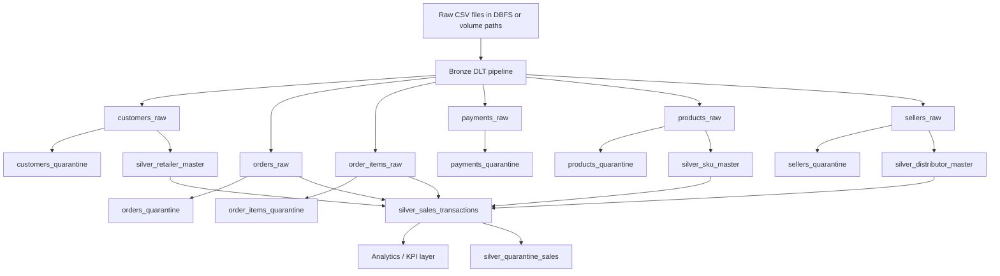

# Pipeline Flow

## Purpose

This document explains the end-to-end data flow implemented in the repository. The codebase is centered on a Databricks Delta Live Tables (DLT) pipeline that ingests raw FMCG source files, applies quality checks, quarantines invalid data, and produces curated transaction and master tables for downstream analytics.

## Scope

This document covers the actual implementation present in the workspace snapshot:

- `FMCG-Pipeline/transformations/bronze/bronze_dlt.py`
- `FMCG-Pipeline/transformations/bronze/common_utils.py`
- `FMCG-Pipeline/transformations/silver/silver_dlt.py`

The repository currently does not contain working gold-layer scripts or populated KPI outputs, so this document focuses on bronze and silver processing and the controls required before analytics delivery.

## Source To Curated Flow

## Bronze Layer Details

The bronze pipeline defines explicit schemas for each source and reads raw CSV files from volume paths such as:

- `/Volumes/fmcg/bronze/customers/customers_raw.csv`
- `/Volumes/fmcg/bronze/orders/orders_raw.csv`
- `/Volumes/fmcg/bronze/order_items/order_items_raw.csv`
- `/Volumes/fmcg/bronze/payments/order_payments_raw.csv`
- `/Volumes/fmcg/bronze/products/products_raw.csv`
- `/Volumes/fmcg/bronze/seller/sellers_raw.csv`

### Bronze processing pattern

Each source follows the same control pattern:

1. Load CSV data with a strict Spark schema.
2. Normalize the column names with `clean_columns`.
3. Filter valid rows into a curated bronze table.
4. Send invalid rows to a quarantine table with a failure reason.
5. Stamp metadata fields for traceability.

### Metadata fields

The bronze tables add the following metadata:

- `_ingest_ts` - ingestion timestamp
- `_source_file` - source file name
- `_batch_id` - batch identifier

### Source controls

- Customers: `customer_id` must be present.
- Orders: `order_id`, `customer_id`, and `order_purchase_timestamp` must be present.
- Order items: `order_id`, `product_id`, `seller_id` must be present and `price > 0`.
- Payments: `order_id` must be present and `payment_value > 0`.
- Products: `product_id` must be present.
- Sellers: `seller_id` must be present.

### Quarantine handling

Invalid rows are not discarded. They are written to quarantine tables with a failure reason to support remediation and audit review.

## Silver Layer Details

The silver pipeline transforms the bronze tables into analytics-friendly entities.

### Master tables

- `silver_retailer_master` from `customers_raw`
- `silver_distributor_master` from `sellers_raw`
- `silver_sku_master` from `products_raw`

These tables standardize and deduplicate master data and expose a consistent business key for downstream joins.

### Transaction table

`silver_sales_transactions` is the core analytical fact table. It is built by joining orders and order items, validating the joined rows, and enriching them with retailer, distributor, and SKU master data.

### Output columns

The curated sales output includes:

- `invoice_id`
- `distributor_id`
- `retailer_id`
- `sku_id`
- `invoice_date`
- `quantity`
- `gross_amount`
- `net_amount`
- `sales_value`
- `channel`
- `processing_ts`

### Sales quarantine

`silver_quarantine_sales` contains records that fail sales-level rules such as:

- zero or negative price
- missing order id
- missing product id
- missing seller id

## Data Quality And Operational Controls

The implementation already supports several client-grade controls:

- strict source schemas
- explicit quarantine tables
- metadata stamping
- deduplication on curated tables
- separation of master and transaction logic

The following controls should be added before production sign-off:

- row counts and source-vs-target reconciliation
- anomaly alerts for quarantine growth
- run-status logging and alerting
- automated testing for transformation logic
- contract tests for schema drift

## Delivery Sequence

1. Land raw files in the DBFS or volume path expected by the bronze pipeline.
2. Run the bronze DLT pipeline to build curated source tables and quarantine tables.
3. Run the silver DLT pipeline to build master tables and transaction facts.
4. Validate quarantine volumes and key metrics.
5. Feed the curated transaction layer into gold KPIs, BI dashboards, or external reporting.

## Open Items Before A Client Delivery

- define the exact refresh cadence for bronze and silver layers
- document the source ownership for each raw file
- wire the pipeline to monitoring and alerting
- confirm whether the project should use CSV, Delta, or both for intermediate layers
- produce sample data and acceptance criteria for end-to-end sign-off

